# InternLM2实战营第二期

## 第七节课 《OpenCompass 大模型评测实战》
官网地址：[书生·浦语官网](https://internlm.intern-ai.org.cn/)  
课程录播视频链接地址：[OpenCompass 大模型评测实战_bilibili](https://www.bilibili.com/video/BV1Pm41127jU/)   

## 1.视频笔记

OpenCompass是一个评测模型的工具，中文名叫司南，首先我们需要了解为什么要进行大模型评测？

1. 因为目前百家争鸣，百花齐放，各种各样的大模型争先开源，许多研究表明大语言模型在多个通用任务上达到或者超越人类水平，但是也有人质疑，模型的能力是否只是对训练数据的记忆而并非像人类那样的去理解？有例子证明，验证力扣（leetcode）题目发现只提供编号，大语言模型就能输出正确的答案，这表明训练数据可能存在污染现象。
2. 其次，评测有助于指导和改进模型和人类的协同交互，大语言模型最终的服务对象是人类，为了更好的设计人机交互的新范式，有必要全面评估模型的各项能力。
3. 最后，评测的研究也可以帮我们更好的规划大语言模型的未来发展，预防未知和潜在的风险。这显得尤为重要
4. 对于大多人来说，大语言模型可能与他们无关，训练成本较高。但是如果模型一旦得到大多人的认可，那么使用起来就及其频繁，比如飞机制造一样。因此，了解不同语言模型之间的性能、舒适性和安全性，能够帮助人们更好的选择合适的模型解决遇到的各种问题。

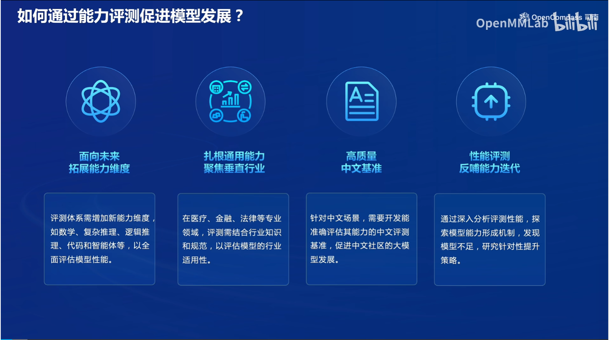

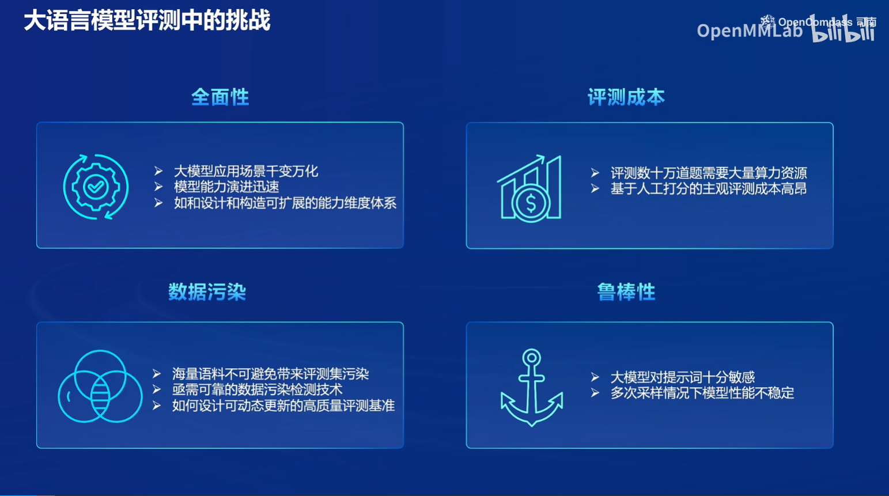

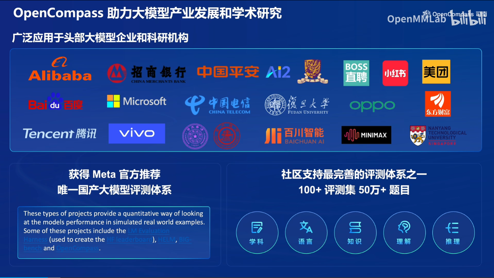

## OpenCompass介绍

上海人工智能实验室科学家团队正式发布了大模型开源开放评测体系 “司南” (OpenCompass2.0)，用于为大语言模型、多模态模型等提供一站式评测服务。其主要特点如下：

- 开源可复现：提供公平、公开、可复现的大模型评测方案
- 全面的能力维度：五大维度设计，提供 70+ 个数据集约 40 万题的的模型评测方案，全面评估模型能力
- 丰富的模型支持：已支持 20+ HuggingFace 及 API 模型
- 分布式高效评测：一行命令实现任务分割和分布式评测，数小时即可完成千亿模型全量评测
- 多样化评测范式：支持零样本、小样本及思维链评测，结合标准型或对话型提示词模板，轻松激发各种模型最大性能
- 灵活化拓展：想增加新模型或数据集？想要自定义更高级的任务分割策略，甚至接入新的集群管理系统？OpenCompass 的一切均可轻松扩展！

## 评测对象

本算法库的主要评测对象为语言大模型与多模态大模型。我们以语言大模型为例介绍评测的具体模型类型。

- 基座模型：一般是经过海量的文本数据以自监督学习的方式进行训练获得的模型（如OpenAI的GPT-3，Meta的LLaMA），往往具有强大的文字续写能力。

- 对话模型：一般是在的基座模型的基础上，经过指令微调或人类偏好对齐获得的模型（如OpenAI的ChatGPT、上海人工智能实验室的书生·浦语），能理解人类指令，具有较强的对话能力。

## 工具架构

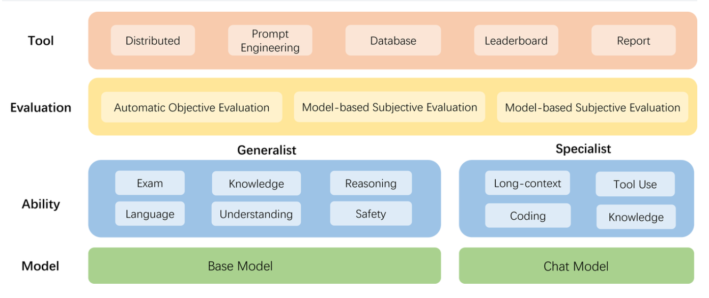

- 模型层：大模型评测所涉及的主要模型种类，OpenCompass 以基座模型和对话模型作为重点评测对象。
- 能力层：OpenCompass 从本方案从通用能力和特色能力两个方面来进行评测维度设计。在模型通用能力方面，从语言、知识、理解、推理、安全等多个能力维度进行评测。在特色能力方面，从长文本、代码、工具、知识增强等维度进行评测。
- 方法层：OpenCompass 采用客观评测与主观评测两种评测方式。客观评测能便捷地评估模型在具有确定答案（如选择，填空，封闭式问答等）的任务上的能力，主观评测能评估用户对模型回复的真实满意度，OpenCompass 采用基于模型辅助的主观评测和基于人类反馈的主观评测两种方式。
- 工具层：OpenCompass 提供丰富的功能支持自动化地开展大语言模型的高效评测。包括分布式评测技术，提示词工程，对接评测数据库，评测榜单发布，评测报告生成等诸多功能。

## 评测方法

评测的标准分为基于模型类别和基于评测本身方式--主客观评测，开放式的问题无法根据简单规则来评价，只能依靠人工评测。

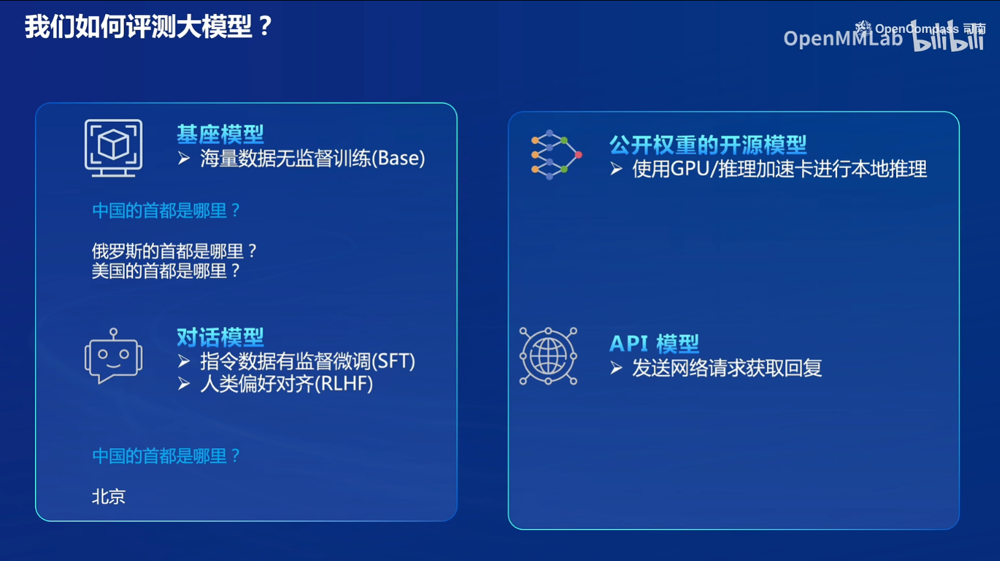

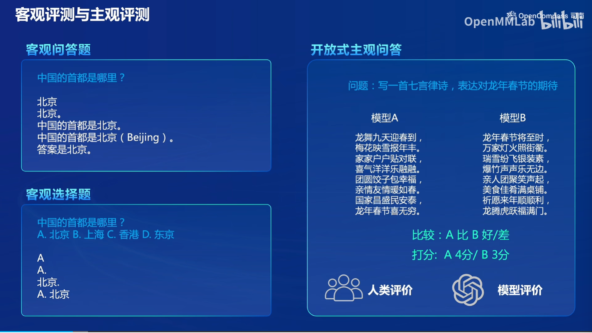

提示词工程（举例）

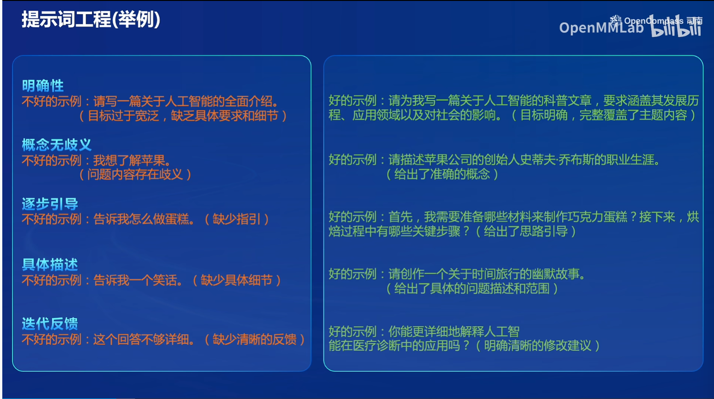

长文本评测（比如比较火的“大海捞针”）

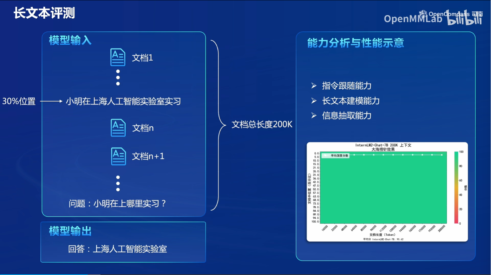

汇集社区力量


大模型评测工具链

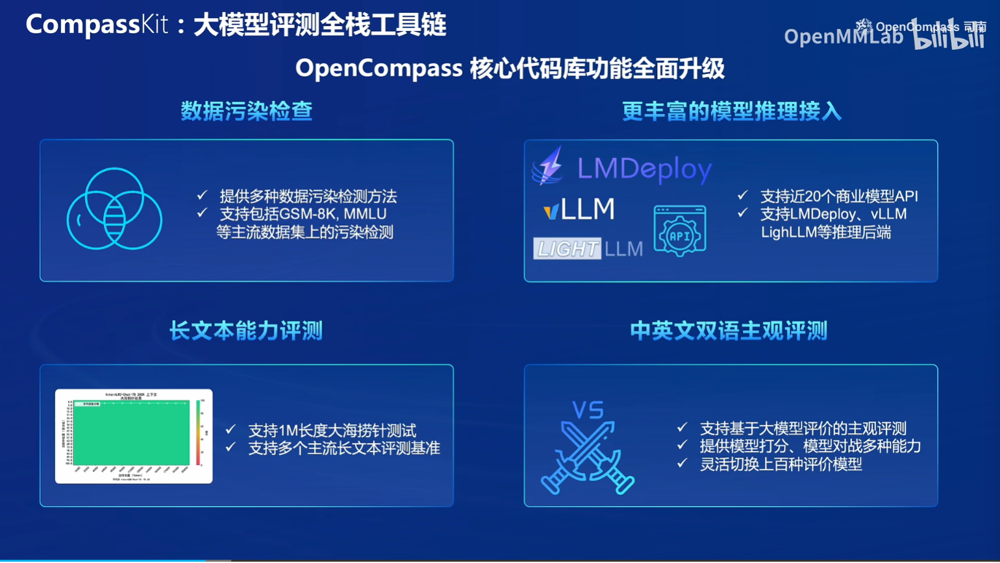

评测流水线（支持任务切分，使能够并行的执行任务，节省时间和硬件资源）

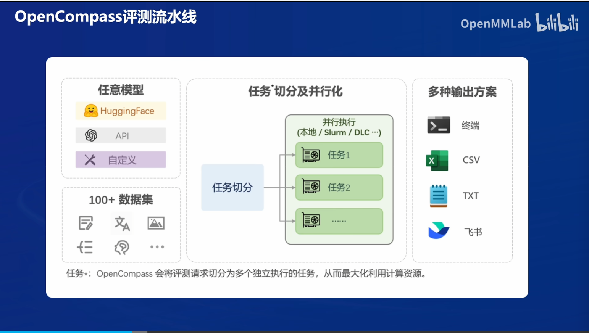

2.0版本升级后能力维度全面升级，还有自研的评测数据集等。

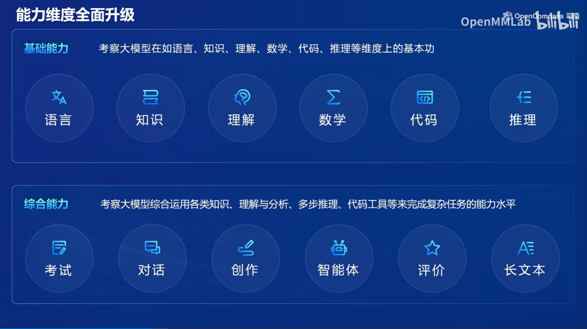

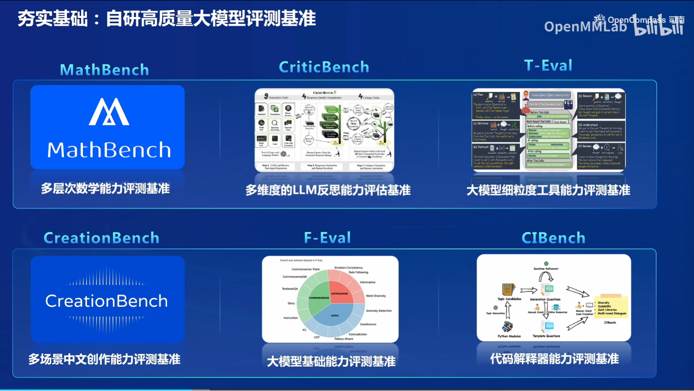

### 概览

在 OpenCompass 中评估一个模型通常包括以下几个阶段：配置 -> 推理 -> 评估 -> 可视化。

- 配置：这是整个工作流的起点。您需要配置整个评估过程，选择要评估的模型和数据集。此外，还可以选择评估策略、计算后端等，并定义显示结果的方式。
- 推理与评估：在这个阶段，OpenCompass 将会开始对模型和数据集进行并行推理和评估。推理阶段主要是让模型从数据集产生输出，而评估阶段则是衡量这些输出与标准答案的匹配程度。这两个过程会被拆分为多个同时运行的“任务”以提高效率，但请注意，如果计算资源有限，这种策略可能会使评测变得更慢。如果需要了解该问题及解决方案，可以参考 FAQ: 效率。
- 可视化：评估完成后，OpenCompass 将结果整理成易读的表格，并将其保存为 CSV 和 TXT 文件。你也可以激活飞书状态上报功能，此后可以在飞书客户端中及时获得评测状态报告。 接下来，我们将展示 OpenCompass 的基础用法，展示书生浦语在 `C-Eval` 基准任务上的评估。它们的配置文件可以在 `configs/eval_demo.py` 中找到。

### 2.接下来实战部分

#### 2.1环境安装

```python
studio-conda -o internlm-base -t opencompass
source activate opencompass
git clone -b 0.2.4 https://github.com/open-compass/opencompass
cd opencompass
pip install -e .

# pip install -e .没有成功,成功了也执行下吧
pip install -r requirements.txt

# 数据准备，解压评测数据到data/下，OpenCompass目录下可以看到
cp /share/temp/datasets/OpenCompassData-core-20231110.zip /root/opencompass/
unzip OpenCompassData-core-20231110.zip
# 列出所有和InternLM及C-Eval相关配置
python tools/list_configs.py internlm ceval
```

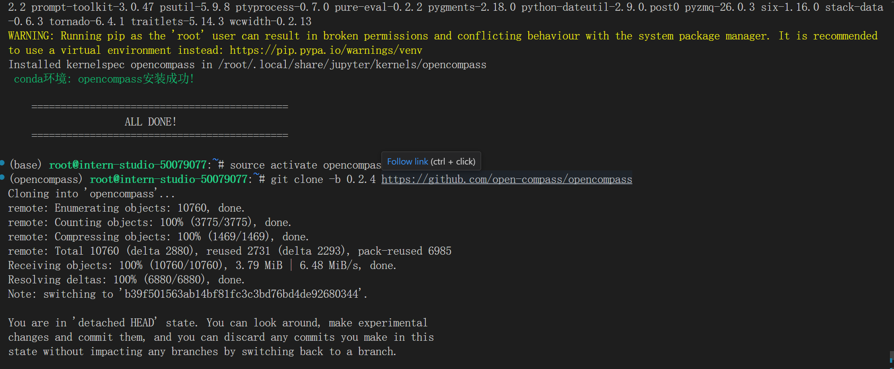

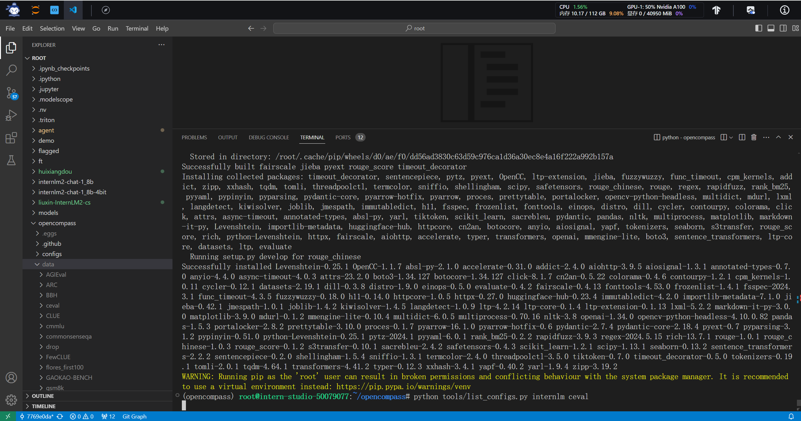

**重点！这里我执行python命令的时候，发现缺失很多大部分我也不知道具体作用的依赖包，所以我建议执行一下`pip install -r requirements.txt`，然后再执行`python tools/list_configs.py internlm ceval`**。

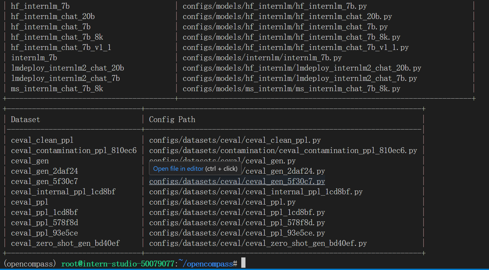

会看到如下：

```python
+----------------------------------------+----------------------------------------------------------------------+
| Model                                  | Config Path                                                          |
|----------------------------------------+----------------------------------------------------------------------|
| hf_internlm2_1_8b                      | configs/models/hf_internlm/hf_internlm2_1_8b.py                      |
| hf_internlm2_20b                       | configs/models/hf_internlm/hf_internlm2_20b.py                       |
| hf_internlm2_7b                        | configs/models/hf_internlm/hf_internlm2_7b.py                        |
| hf_internlm2_base_20b                  | configs/models/hf_internlm/hf_internlm2_base_20b.py                  |
| hf_internlm2_base_7b                   | configs/models/hf_internlm/hf_internlm2_base_7b.py                   |
| hf_internlm2_chat_1_8b                 | configs/models/hf_internlm/hf_internlm2_chat_1_8b.py                 |
| hf_internlm2_chat_1_8b_sft             | configs/models/hf_internlm/hf_internlm2_chat_1_8b_sft.py             |
| hf_internlm2_chat_20b                  | configs/models/hf_internlm/hf_internlm2_chat_20b.py                  |
| hf_internlm2_chat_20b_sft              | configs/models/hf_internlm/hf_internlm2_chat_20b_sft.py              |
| hf_internlm2_chat_20b_with_system      | configs/models/hf_internlm/hf_internlm2_chat_20b_with_system.py      |
| hf_internlm2_chat_7b                   | configs/models/hf_internlm/hf_internlm2_chat_7b.py                   |
| hf_internlm2_chat_7b_sft               | configs/models/hf_internlm/hf_internlm2_chat_7b_sft.py               |
| hf_internlm2_chat_7b_with_system       | configs/models/hf_internlm/hf_internlm2_chat_7b_with_system.py       |
| hf_internlm2_chat_math_20b             | configs/models/hf_internlm/hf_internlm2_chat_math_20b.py             |
| hf_internlm2_chat_math_20b_with_system | configs/models/hf_internlm/hf_internlm2_chat_math_20b_with_system.py |
| hf_internlm2_chat_math_7b              | configs/models/hf_internlm/hf_internlm2_chat_math_7b.py              |
| hf_internlm2_chat_math_7b_with_system  | configs/models/hf_internlm/hf_internlm2_chat_math_7b_with_system.py  |
| hf_internlm_20b                        | configs/models/hf_internlm/hf_internlm_20b.py                        |
| hf_internlm_7b                         | configs/models/hf_internlm/hf_internlm_7b.py                         |
| hf_internlm_chat_20b                   | configs/models/hf_internlm/hf_internlm_chat_20b.py                   |
| hf_internlm_chat_7b                    | configs/models/hf_internlm/hf_internlm_chat_7b.py                    |
| hf_internlm_chat_7b_8k                 | configs/models/hf_internlm/hf_internlm_chat_7b_8k.py                 |
| hf_internlm_chat_7b_v1_1               | configs/models/hf_internlm/hf_internlm_chat_7b_v1_1.py               |
| internlm_7b                            | configs/models/internlm/internlm_7b.py                               |
| ms_internlm_chat_7b_8k                 | configs/models/ms_internlm/ms_internlm_chat_7b_8k.py                 |
+----------------------------------------+----------------------------------------------------------------------+
+--------------------------------+-------------------------------------------------------------------+
| Dataset                        | Config Path                                                       |
|--------------------------------+-------------------------------------------------------------------|
| ceval_clean_ppl                | configs/datasets/ceval/ceval_clean_ppl.py                         |
| ceval_contamination_ppl_810ec6 | configs/datasets/contamination/ceval_contamination_ppl_810ec6.py  |
| ceval_gen                      | configs/datasets/ceval/ceval_gen.py                               |
| ceval_gen_2daf24               | configs/datasets/ceval/ceval_gen_2daf24.py                        |
| ceval_gen_5f30c7               | configs/datasets/ceval/ceval_gen_5f30c7.py                        |
| ceval_ppl                      | configs/datasets/ceval/ceval_ppl.py                               |
| ceval_ppl_1cd8bf               | configs/datasets/ceval/ceval_ppl_1cd8bf.py                        |
| ceval_ppl_578f8d               | configs/datasets/ceval/ceval_ppl_578f8d.py                        |
| ceval_ppl_93e5ce               | configs/datasets/ceval/ceval_ppl_93e5ce.py                        |
| ceval_zero_shot_gen_bd40ef     | configs/datasets/ceval/ceval_zero_shot_gen_bd40ef.py              |
| configuration_internlm         | configs/datasets/cdme/internlm2-chat-7b/configuration_internlm.py |
| modeling_internlm2             | configs/datasets/cdme/internlm2-chat-7b/modeling_internlm2.py     |
| tokenization_internlm          | configs/datasets/cdme/internlm2-chat-7b/tokenization_internlm.py  |
+--------------------------------+-------------------------------------------------------------------+
```

确保按照上述步骤正确安装 OpenCompass 并准备好数据集后，可以通过以下命令评测 InternLM2-Chat-1.8B 模型在 C-Eval 数据集上的性能。由于 OpenCompass 默认并行启动评估过程，我们可以在第一次运行时以 --debug 模式启动评估，并检查是否存在问题。在 --debug 模式下，任务将按顺序执行，并实时打印输出。

```python
python run.py --datasets ceval_gen --hf-path /share/new_models/Shanghai_AI_Laboratory/internlm2-chat-1_8b --tokenizer-path /share/new_models/Shanghai_AI_Laboratory/internlm2-chat-1_8b --tokenizer-kwargs padding_side='left' truncation='left' trust_remote_code=True --model-kwargs trust_remote_code=True device_map='auto' --max-seq-len 1024 --max-out-len 16 --batch-size 2 --num-gpus 1 --debug
```

**如果上述步骤遇到错误，根据错误提示解决即可，一般是缺少xxx依赖，直接pip即可**

执行：

```python
pip install protobuf
```

对上面run命令解析：

```python
python run.py
--datasets ceval_gen \
--hf-path /share/new_models/Shanghai_AI_Laboratory/internlm2-chat-1_8b \  # HuggingFace 模型路径
--tokenizer-path /share/new_models/Shanghai_AI_Laboratory/internlm2-chat-1_8b \  # HuggingFace tokenizer 路径（如果与模型路径相同，可以省略）
--tokenizer-kwargs padding_side='left' truncation='left' trust_remote_code=True \  # 构建 tokenizer 的参数
--model-kwargs device_map='auto' trust_remote_code=True \  # 构建模型的参数
--max-seq-len 1024 \  # 模型可以接受的最大序列长度
--max-out-len 16 \  # 生成的最大 token 数
--batch-size 2  \  # 批量大小
--num-gpus 1  # 运行模型所需的 GPU 数量
--debug
```

**遇到错误mkl-service + Intel(R) MKL MKL_THREADING_LAYER=INTEL is incompatible with libgomp.so.1 ... 解决方案：**

```python
export MKL_SERVICE_FORCE_INTEL=1
#或
export MKL_THREADING_LAYER=GNU
```

**建议在执行run命令之前，先export配置环境变量。然后再执行run命令，遇到错误建议检查是否安装protobuf**

如果一切正常，您应该看到屏幕上显示 “Starting inference process”：

```python
[2024-03-18 12:39:54,972] [opencompass.openicl.icl_inferencer.icl_gen_inferencer] [INFO] Starting inference process...
```

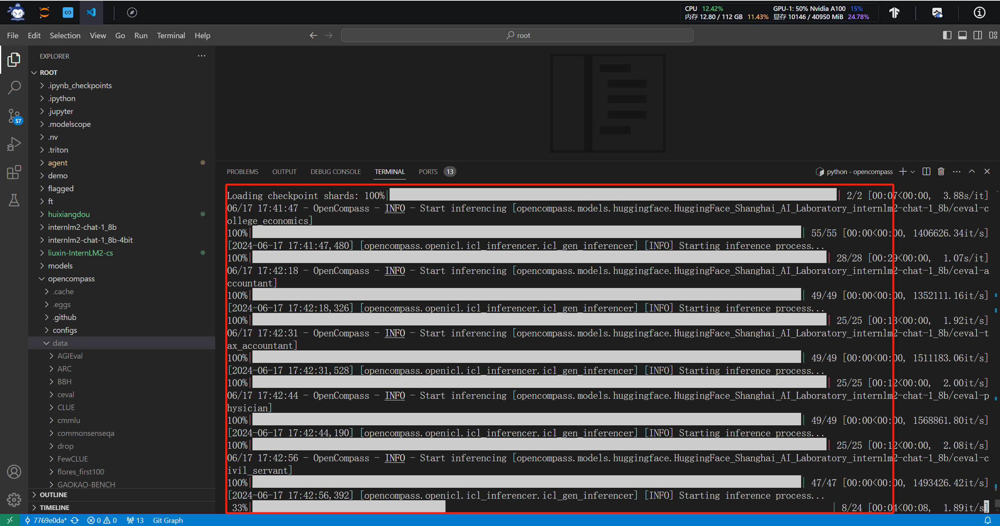

评测完成后，将会看到：

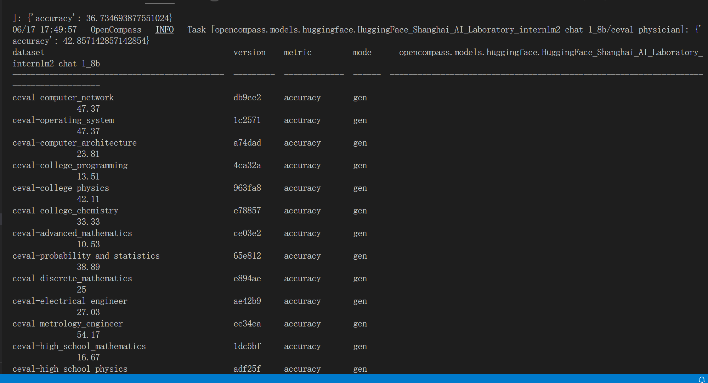

#### 自定义数据集客主观评测：量身定制，慧眼识珠

##### 自建客观数据集步骤

详细的客观评测指引参见 https://opencompass.readthedocs.io/zh-cn/latest/advanced_guides/new_dataset.html

##### 主观评测简介

由于客观评测只能反映模型在一些性能数据上的指标，没法完全真实地反映模型在与人类对话时的表现，因此需要在真实的对话场景下通过主观评测的方式翻译模型的真实性能。 而由于完全靠人力来进行主观评测是费时费力的，因此有很多利用模型来进行主观评测的方式。 这些方式主要可以分为以下几类：打分，对战，多模型评测等。

##### 自建主观数据集步骤

详细的主观评测指引参见 https://opencompass.readthedocs.io/zh-cn/latest/advanced_guides/subjective_evaluation.html

#### 数据污染评估：禁止作弊，诚信考试

##### 数据污染评估简介

数据污染 是指本应用在下游测试任务中的数据出现在了大语言模型 (LLM) 的训练数据中，从而导致在下游任务 (例如，摘要、自然语言推理、文本分类) 上指标虚高，无法反映模型真实泛化能力的现象。 由于数据污染的源头是出现在 LLM 所用的训练数据中，因此最直接的检测数据污染的方法就是将测试数据与训练数据进行碰撞，然后汇报两者之间有多少语料是重叠出现的，经典的 GPT-3 论文中的表 C.1 会报告了相关内容。 但如今开源社区往往只会公开模型参数而非训练数据集，在此种情况下 如何判断是否存在数据污染问题或污染程度如何，这些问题还没有被广泛接受的解决方案。OpenCompass 提供了两种可能的解决方案。

##### 实验评估步骤

https://opencompass-cn.readthedocs.io/zh-cn/latest/advanced_guides/contamination_eval.html

#### 大海捞针：星辰藏海深，字海寻珠难

##### 大海捞针测试简介

大海捞针测试（灵感来自 NeedleInAHaystack）是指通过将关键信息随机插入一段长文本的不同位置，形成大语言模型 (LLM) 的Prompt，通过测试大模型是否能从长文本中提取出关键信息，从而测试大模型的长文本信息提取能力的一种方法，可反映LLM长文本理解的基本能力。

##### 数据集介绍

Skywork/ChineseDomainModelingEval 数据集收录了 2023 年 9 月至 10 月期间发布的高质量中文文章，涵盖了多个领域。这些文章确保了公平且具有挑战性的基准测试。 该数据集包括特定领域的文件：

- zh_finance.jsonl 金融
- zh_game.jsonl 游戏
- zh_government.jsonl 政务
- zh_movie.jsonl 电影
- zh_tech.jsonl 技术
- zh_general.jsonl 综合

这些文件用于评估LLM对不同特定领域的理解能力。

##### 实验评估步骤

https://opencompass.readthedocs.io/zh-cn/latest/advanced_guides/needleinahaystack_eval.html


### 总结

模型评测是很重要且有必要的，任何开源模型都经过了评测这一重要环节，甚至开源后和很多基座大模型都会通过评测来评估模型在密集型任务的性能表现，就我个人而言，都是根据目标需求去评估模型的任务表现，其实很宽泛不够精细，模型有可能会出现比如幻觉，实时性任务不佳，过拟合等表现。OpenCompass工具主要评测对象就是语言大模型和多模态大模型，比如基座模型GPT-3，LLama等，还有书生浦语大模型，ChatGPT等对话模型，从工具架构来看，方法层OpenCompass采用客观评测和主观评测两种评测方式，客观就是看模型在具有确定答案的能力；主观就是评估用户对模型回复的满意度，分为模型辅助和基于人类反馈的主观评测。能力层，OpenCompass分为通用能力和特色能力两个维度设计的，通用能力方面，从语言，知识，考试，理解，推理，安全等多个维度评测，特色能力从长文本，工具使用，代码编辑，知识增强等维度评测。
